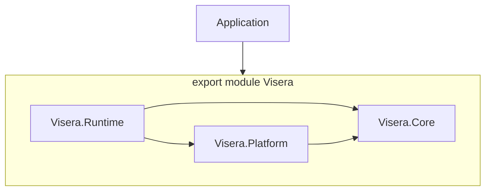

# Engine architecture

This page describes the layout and module graph of the Visera engine **as present in this repository** under `External/Visera`. Upstream documentation or other forks may differ; treat the source tree and CMake files as authoritative.

## Repository layers

| Area | Path (under `Engine/`) | Role |
|------|------------------------|------|
| **Core** | `Core/` | Foundation: math, types, OS abstraction, log, concurrency, compression, and related submodules. Module `Visera.Core`. |
| **Platform** | `Platform/` | Window, path, file system, dynamic library loading. Interface plus Windows, macOS, GLFW, and Null implementations. Module `Visera.Platform`. |
| **Runtime** | `Runtime/` | Game-facing services: RHI, graphics, AssetHub, audio, input, UI, window, scripting. Module `Visera.Runtime`. |
| **Forge** | `Forge/` | Optional **toolchain** (shader compilation, utilities). Built as separate executable `Visera-Forge` when `VISERA_BUILD_FORGE` is on. Module `Visera.Forge` is used by that tool, not re-exported by the main `Visera` umbrella for typical games. |
| **APIs** | `APIs/` | TypeScript declarations (`Visera.d.ts`) for script-facing types. |
| **Schemas** | `Schemas/` | JSON Schema files for data formats (e.g. materials, input maps). |
| **Shaders** | `Shaders/` | Engine Slang sources included by the shader pipeline and Forge. |

See [Repository layout](Repository-Layout.md) for a concise file-tree oriented summary.

## Umbrella module and dependencies

The primary library target is **`Visera`** (see root `External/Visera/CMakeLists.txt`). The public C++ module entry is `Engine/Visera.ixx`:

- `export import Visera.Core;`
- `export import Visera.Runtime;`
- `export import Visera.Platform;`

Runtime depends on Core and Platform; Platform depends on Core. Core does not depend on Platform or Runtime.

## Runtime submodules (public)

`Visera.Runtime` re-exports these subsystems (see `Runtime/Source/Visera-Runtime.ixx`):

- `Visera.Runtime.AssetHub`
- `Visera.Runtime.Audio`
- `Visera.Runtime.Graphics`
- `Visera.Runtime.Input`
- `Visera.Runtime.RHI`
- `Visera.Runtime.UI`
- `Visera.Runtime.Window`
- `Visera.Runtime.Scripting`

**Internal / reserved:** `Visera.Runtime.World` exists under `Runtime/Source/World/` but is **not** imported by `Visera.Runtime`. Do not rely on it from the public Runtime API until it is wired into the umbrella.

## Engine instance: create info, modes, and main loop

### `FEngineCreateInfo` and `FViseraEngine`

`FEngineCreateInfo` holds optional create-info blocks. Each `TOptional` field, when set, enables that service. Typical fields: `MainWindow`, `RHI`, `AssetHub`, `AudioEngine`, `Graphics`, `Input`, `UI`, `Scripting`.

Service construction order matters in `FViseraEngine::CreateServices`:

- **Graphics** is only created if both **RHI** and **AssetHub** are enabled (graphics needs both pointers).
- **Scripting** requires **Graphics** and **AssetHub**. If `MainWindow` was not set, scripting may register `visera.setMainWindow`; the engine can then call `ResolveMainWindow()` after construction to obtain a `FWindowCreateInfo` and create the window.
- **UI** requires **Window**, **Graphics**, and **Input**.

### `EEngineMode`

`Visera::CreateEngine(EEngineMode)` fills a default `FEngineCreateInfo`:

- **`Standard`** — Enables RHI, AssetHub, audio (Wwise with a default bank path), graphics, input, scripting. `MaxFrameRate` defaults to 60.
- **`Forge`** — **AssetHub only** (batch / tooling style). No full `Run()` loop configuration; intended for toolchain use alongside `Visera-Forge`, not a full game stack.

### `Run()`

`FViseraEngine::Run()` requires a **main window**. If no window exists, it logs a warning and returns immediately. Per-frame order (simplified): input poll → `OnTick` → scripting `Tick` → audio `Tick` → `OnPreRender` → `Graphics->Render(Window)` → `OnPostRender` → frame pacing when `MaxFrameRate > 0`.

## Build and platform notes

- **C++ standard:** CMake sets **C++23** for the Visera project.
- **Platform CMake:** `Engine/Platform/CMake/install.cmake` configures native implementations for **Windows** or **Apple** only; other hosts fail configuration. On Windows and Apple builds, **GLFW** and **Null** platform modules are still compiled and available alongside the native backend for windowing and headless scenarios as designed in that tree.

## See also

- [Core](Core/index.md) — foundation library
- [Platform](Platform/index.md) — OS and window abstraction
- [Runtime](Runtime/index.md) — application-facing services
- [Forge](Forge/index.md) — optional toolchain executable
- [Repository layout](Repository-Layout.md) — `APIs`, `Schemas`, `Shaders`
