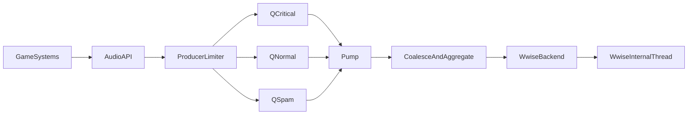

# Audio (Wwise Runtime Design)

This page documents the current audio runtime design used by `Visera.Runtime.Audio` with Wwise backend integration.

## Scope

- Backend: Wwise 2025.1.3 (regular `AK::SoundEngine::*` APIs).
- Threading mode: rely on Wwise internal audio thread (`bUseLEngineThread=true`).
- Engine-side scheduling: main-thread `Pump()` + priority queues + limiter/coalesce.
- Primary target: VS-like gameplay with heavy unit and particle event bursts.

## Why this architecture

- Keep backend execution in one place (Wwise internal queue/thread), avoid queue-on-queue complexity in phase 1.
- Let game systems submit commands concurrently through MPSC queues.
- Centralize overload handling (`Priority`, `Category`, limiter, coalesce, aggregation) before backend calls.

## Data flow



## Runtime model

### 1) Priority queues

Audio commands are split into 3 MPSC queues:

- `Critical`
- `Normal`
- `Spam`

Producer threads enqueue directly into the corresponding queue.

### 2) Pump budget and fairness

Each tick, `FAudio::Pump()` drains queues with per-priority quotas:

- `Critical`: guaranteed minimum budget
- `Normal`: main throughput
- `Spam`: limited budget, can be dropped on pressure

When the frame is overloaded and spam backlog is high, spam commands are actively dropped first.

### 3) Command coalesce

Within one pump batch:

- `SetRTPC`: same `(object, rtpc)` keeps only the last command.
- `SetPosition`: same `object` keeps only the last command.

This cuts redundant high-frequency updates dramatically in dense gameplay.

### 4) Impact aggregation

For non-critical impact events:

- bucket by `(eventID, spatialCell)` in the same batch
- keep strongest/intended representative command

This is aimed at particle-heavy collision bursts.

## Interface layering

- `IAudioEngine` uses backend-agnostic IDs:
  - `FObjectID`, `FEventID`, `FRTPCID`, `FPlayingID`
- Wwise backend performs local casts to `AkGameObjectID` / `AkUniqueID` / `AkRtpcID`.
- This avoids leaking Wwise-specific types into runtime interface.

## Logging and observability

`FAudio` periodically reports:

- enqueued by priority
- dropped spam
- posted events
- coalesced RTPC/position counts
- impact aggregation count
- failed backend calls
- pending queue sizes

## Config keys (current)

- `Audio.Pump.CriticalMinPerTick`
- `Audio.Pump.NormalMaxPerTick`
- `Audio.Pump.SpamMaxPerTick`
- `Audio.Pump.SpamDropPerTick`
- `Audio.Pump.MaxCommandsPerTick`
- `Audio.Queue.MaxPendingSpam`
- `Audio.Wwise.CommandQueueSizeBytes`

## Minimal gameplay usage

Assume soundbanks are already prepared in `Assets/Sound`.

```cpp
// Acquire service
auto* Audio = Engine->GetAudio();

// Register emitters
auto bgmEmitter    = Audio->RegisterEmitter(FName{"BGMEmitter"}, FAudio::EPriority::Critical);
auto playerEmitter = Audio->RegisterEmitter(FName{"PlayerEmitter"}, FAudio::EPriority::Critical);

// Startup BGM
Audio->PostEvent(FName{"Play_BGM_Main"},
                 bgmEmitter,
                 FAudio::ECategory::Ambient,
                 FAudio::EPriority::Critical,
                 1.0f,
                 0);

// Per-frame (main loop)
Audio->Tick();

// Collision SFX (example trigger)
Audio->PostEvent(FName{"Play_SFX_Hit"},
                 playerEmitter,
                 FAudio::ECategory::Impact,
                 FAudio::EPriority::Normal,
                 1.0f,
                 0);
```

## SoundBank layout and loading

Banks are loaded at bootstrap. Expected layout:

- `Assets/SoundBank/Main/` — base path for banks (configurable via `Audio.Bank.BasePath`)
- `Init.bnk` — initialization bank (loaded first)
- `Main.bnk` — main bank with events

Config keys:

- `Audio.Bank.BasePath` — base path for bank resolution (default: `Assets/SoundBank/Main`)
- `Audio.Bank.Init` — init bank name (default: `Init.bnk`)
- `Audio.Bank.Main` — main bank name (default: `Main.bnk`)

## Naming recommendation (Wwise side)

For the minimal loop above, keep at least:

- Event: `Play_BGM_Main`
- Event: `Play_SFX_Hit`

Add RTPCs later only when needed for dynamic mix/intensity.

## Next steps

- Add hot-reload for audio config thresholds via `OnConfigChange`.
- Add JavaScript-safe audio scripting facade (command submission only).
- Add component lifecycle helpers for pooled entities.
