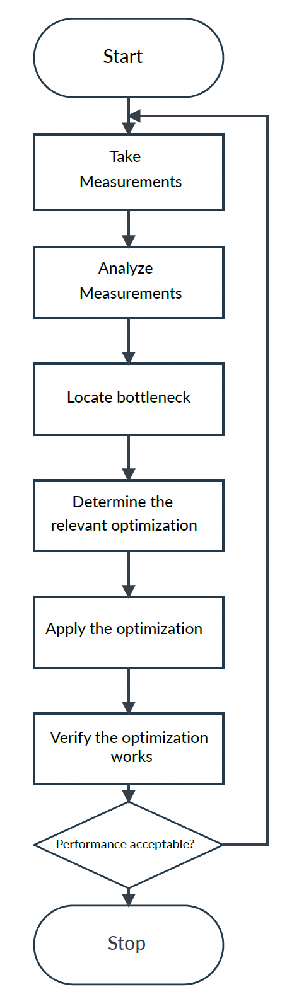

# Toolset
"Mali Offine Compiler"
{
    
}

# Basic optimization workflow
Try to repeat the following process until your application fulfills its computation budget:
• Take measurements.
• Locate the bottleneck.
• Determine and apply an optimization.
• Verify the optimization improves performance.

Measurements must be taken with real hardware, for example with the Arm GPU you want to test
the performance on. Verifying performance gains from an optimization is important because there
can be multiple bottlenecks, and some optimizations are context-dependent.

Consider the following areas when determining where an optimization is needed:
[Application]
• Application code.
• Misuse of API.
• Use of blocking API calls.
[Vertex Processing]
• Vertex processing.
• Triangle setup.
[Shading]
• Fragment processing.
[Shader Resource]
• Memory bandwidth.

# Optimization Pitfalls to Avoid
• Do not use frames per second as a measurement. Use frame times, because improvements are
linear and easier to interpret. Frames per second gives a skewed inverse measurement.
• Do not assume that because your GPU bottleneck is fixed that your CPU is running fast
enough, or too slow. Bottlenecks move between processors, so be sure to measure all of them
to monitor performance.
• Do not keep optimizing fragment shaders when the application is either vertex shader
or application-bound, or vice versa. Work on the bottleneck. Indeed, you can improve
performance by moving work to the less heavily loaded parts of the pipeline.
• Make sure VSYNC is off when taking measurements.
